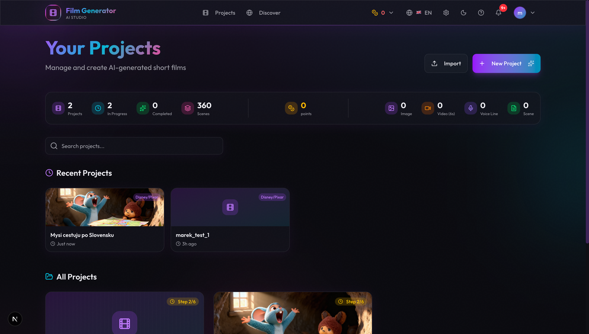
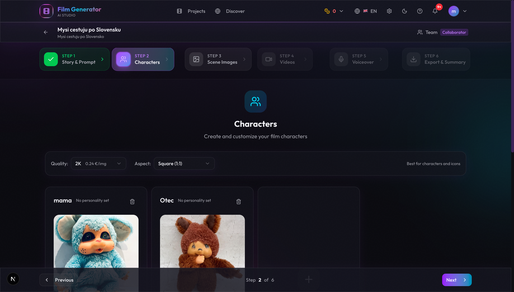
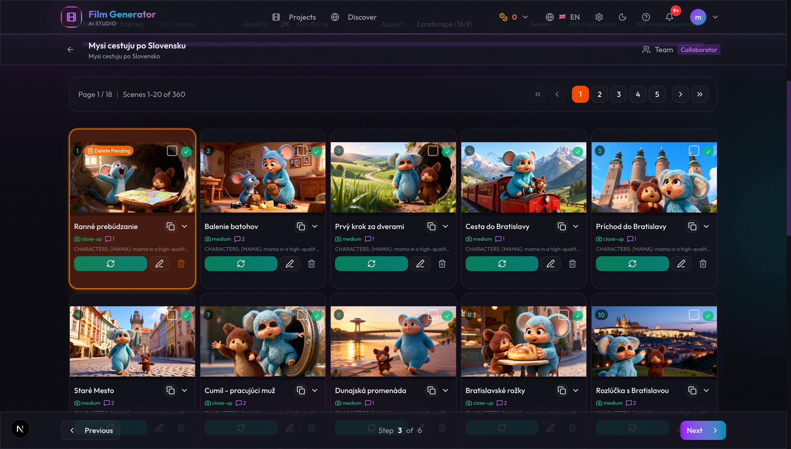

# Film Generator

AI-powered film creation studio that generates complete short films from text prompts. Create characters, scenes, images, videos, and voiceovers - all powered by AI.



## Features

- **Story Generation** - Generate complete film stories with AI (Claude, OpenRouter)
- **Character Creation** - Create and customize characters with AI-generated images
- **Scene Management** - Up to 360 scenes per project with automatic prompt generation
- **Image Generation** - Generate scene images (Gemini, Modal/Qwen)
- **Video Generation** - Convert images to videos (Kie.ai, Modal/Hallo3)
- **Voiceover** - Text-to-speech for character dialogue (Gemini TTS, ElevenLabs, Modal)
- **Music** - Background music generation (Suno/PiAPI, Modal)
- **Team Collaboration** - Invite collaborators with approval workflows
- **Multi-language** - English and Slovak UI support

## Screenshots

### Character Editor
Create and manage film characters with AI-generated portraits and master prompts for consistent appearance.



### Scene Image Editor
Generate and manage scene images with batch processing, quality selection, and regeneration options.



## Tech Stack

- **Frontend**: Next.js 16, React 19, Tailwind CSS 4, Zustand
- **Backend**: Next.js API Routes, Prisma ORM
- **Database**: Neon PostgreSQL
- **Auth**: NextAuth v5
- **Background Jobs**: Inngest
- **Payments**: Polar.sh
- **AI Providers**: Modal (self-hosted), OpenRouter, Gemini, ElevenLabs

## Getting Started

### Prerequisites

- Node.js 22+
- PostgreSQL database (Neon recommended)
- API keys for AI providers (see Settings page)

### Installation

```bash
# Clone the repository
git clone https://github.com/your-username/film-generator.git
cd film-generator

# Install dependencies
npm install

# Set up environment variables
cp .env.example .env.local
# Edit .env.local with your database URL and secrets

# Push database schema
npm run db:push

# Start development server
npm run dev
```

### Running Background Jobs

Scene and image generation use Inngest for background processing:

```bash
npx inngest-cli@latest dev
```

Open http://localhost:8288 to view the Inngest dashboard.

## Configuration

### AI Providers

Configure AI providers in the Settings page:

| Feature | Providers |
|---------|-----------|
| LLM (Story) | OpenRouter, Claude CLI, Modal |
| Images | Gemini, Modal (Qwen) |
| Videos | Kie.ai, Modal (Hallo3) |
| TTS | Gemini TTS, ElevenLabs, Modal |
| Music | PiAPI/Suno, Modal |

### Modal Endpoints (Self-hosted)

Deploy your own AI endpoints on Modal.com:

```bash
modal deploy modal/image_edit_generator.py
modal deploy modal/image_generator.py
```

## Project Structure

```
src/
├── app/                    # Next.js App Router
│   ├── api/               # REST API endpoints
│   ├── project/[id]/      # Project editor
│   └── settings/          # User settings
├── components/
│   ├── workflow/          # Step-by-step workflow components
│   └── collaboration/     # Team collaboration features
├── lib/
│   ├── inngest/           # Background job definitions
│   ├── services/          # Business logic
│   └── stores/            # Zustand state management
└── types/                 # TypeScript definitions

modal/                     # Python Modal endpoints
prisma/schema.prisma       # Database schema
```

## License

MIT
