# Generátor filmov - Kompletná Technická Dokumentácia


## Obsah

1. [Úvod](#úvod)
2. [Architektúra systému](#architektúra-systému)
3. [Databázová schéma](#databázová-schéma)
4. [API koncové body](#api-koncové-body)
5. [UML Diagramy - Toky a Rozhodovacie stromy](#uml-diagramy---toky-a-rozhodovacie-stromy)
6. [Systém rolí a oprávnení](#systém-rolí-a-oprávnení)
7. [Autentizácia](#autentizácia)
8. [Cache systém](#cache-systém)
9. [AI Poskytovatelia](#ai-poskytovatelia)
10. [Cenové plány](#cenové-plány)
11. [Chybové kódy](#chybové-kódy)

---

## Úvod

**Generátor filmov** je AI-powered aplikácia na tvorbu krátkych animovaných filmov. Umožňuje používateľom vytvárať profesionálne videá od konceptu príbehu až po finálny export pomocou 6-krokového workflow.

### Kľúčové funkcie

- AI Generovanie príbehov - Premieňa nápady na kompletné filmové scenáre
- Dizajn postáv - Vytvára konzistentné postavy s vizuálnou stabilitou
- Generovanie scén - Vytvára vizuály pre každú scénu pomocou AI
- Video animácia - Oživuje scény pomocou AI video generátorov
- AI Hlasové komentáre - Pridáva profesionálne hlasy postáv
- Export a zdieľanie - Stiahne celý film alebo ho zdieľa priamo

### Podporované jazyky

- Slovenčina - Plná lokalizácia rozhrania a AI hlasový komentár
- Angličtina - Alternatívny jazyk rozhrania

---

## Architektúra systému

### Technológia stack

#### Frontend

- Next.js 16.1.1 (App Router)
- React 19.2.3
- Radix UI (komponenty)
- Tailwind CSS v4
- Framer Motion (animácie)
- next-intl (lokalizácia)

#### Backend

- Next.js API Routes
- Prisma ORM
- PostgreSQL (Neon serverless)
- NextAuth.js v5 (autentizácia)

#### State Management

- Zustand (globálny state)
- SWR (data fetching)
- In-Memory Cache

#### AI Services

- Google Gemini (LLM, TTS, obrázky)
- Claude/Anthropic (LLM)
- OpenRouter (LLM routing)
- KIE.ai (video, obrázky, TTS)
- ElevenLabs (TTS)
- Modal.com (self-hosted modely)
- PiAPI/Suno (hudba)

### Architektúra systému

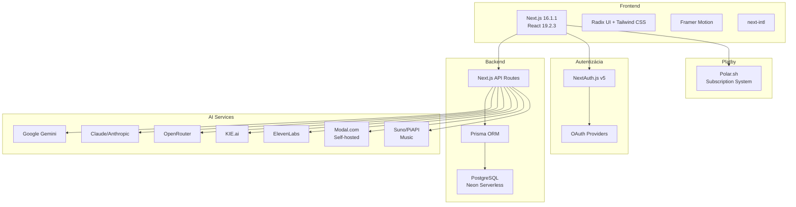

### Štruktúra projektu

```
src/
├── app/
│   ├── api/                    # API Routes
│   │   ├── projects/           # Project CRUD + collaboration
│   │   ├── admin/              # Admin endpoints
│   │   ├── auth/               # Authentication
│   │   ├── gemini/             # Gemini AI proxy
│   │   ├── llm/                # LLM endpoints
│   │   ├── image/              # Image generation
│   │   ├── video/              # Video composition
│   │   ├── tts/                # Text-to-Speech
│   │   ├── music/              # Music generation
│   │   ├── credits/            # Credit management
│   │   ├── statistics/         # Usage statistics
│   │   ├── notifications/      # Notification system
│   │   └── polar/              # Payment webhooks
│   ├── projects/               # Project UI
│   ├── settings/               # Settings UI
│   ├── discover/               # Public projects
│   └── admin/                  # Admin panel
├── components/
│   ├── workflow/               # 6-step workflow
│   ├── collaboration/          # Team features
│   └── ui/                     # Base components
├── lib/
│   ├── auth.ts                 # NextAuth config
│   ├── db/
│   │   └── prisma.ts           # Prisma client
│   ├── permissions.ts          # RBAC system
│   ├── cache.ts                # Cache layer
│   └── services/
│       ├── pricing-service.ts  # Cost calculations
│       └── credits.ts          # Credit management
├── types/                      # TypeScript types
└── messages/                   # i18n translations (en, sk)
```

---

## Databázová schéma

### Entity Relationships

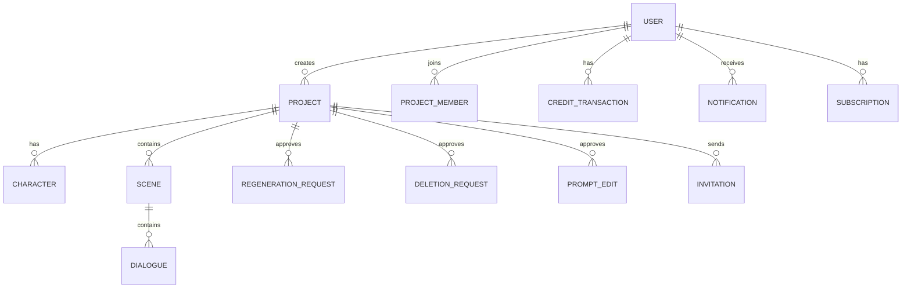

### Tabuľky a ich štruktúra

#### User (Používateľ)

```typescript
interface User {
  id: string                  // UUID
  name: string                // Meno
  email: string               // Email (unique)
  emailVerified: Date         // Overenie emailu
  image: string | null        // Profilový obrázok URL
  isAdmin: boolean            // Admin práva
  plan: string                // Subscription plan (free, starter, pro, studio)
  creditsBalance: number      // Aktuálny zostatok kreditov
  totalCreditsEarned: number  // Celkom získané kredity
  totalCreditsSpent: number   // Celkom minuté kredity
  createdAt: Date             // Dátum registrácie
  updatedAt: Date             // Posledná úprava
}
```

#### Project (Projekt)

```typescript
interface Project {
  id: string                  // UUID
  userId: string              // Vlastník (FK na User)
  name: string                // Názov projektu
  style: string               // Vizuálny štýl (disney, realistic, anime, custom)
  masterPrompt: string | null // Hlavný prompt pre AI
  story: JSON                 // Príbehové dáta
  currentStep: number         // Aktuálny krok workflow (1-6)
  isComplete: boolean         // Dokončený projekt
  visibility: string          // 'private' | 'public'
  settings: JSON              // Nastavenia projektu
  voiceSettings: JSON         // Nastavenia hlasu
  backgroundMusic: JSON | null // Hudba na pozadí
  renderedVideoUrl: string | null // Finálne video URL
  renderedDraftUrl: string | null  // Draft video URL
  createdAt: Date
  updatedAt: Date
}
```

#### Character (Postava)

```typescript
interface Character {
  id: string                  // UUID
  projectId: string           // Projekt (FK)
  name: string                // Meno postavy
  description: string         // Popis postavy
  visualDescription: string   // Vizuálny popis pre AI
  personality: string         // Osobnosť
  masterPrompt: string | null // Prompt pre konzistenciu
  imageUrl: string | null     // URL obrázku postavy
  voiceId: string | null      // TTS voice ID
  voiceName: string | null    // Názov hlasu
}
```

#### Scene (Scéna)

```typescript
interface Scene {
  id: string                  // UUID
  projectId: string           // Projekt (FK)
  number: number              // Číslo scény (poradie)
  title: string               // Názov scény
  description: string         // Popis scény
  textToImagePrompt: string   // Prompt pre T2I
  imageToVideoPrompt: string  // Prompt pre I2V
  cameraShot: string          // 'close-up' | 'medium' | 'wide'
  imageUrl: string | null     // URL obrázku
  videoUrl: string | null     // URL videa
  audioUrl: string | null     // URL audio (TTS)
  duration: number            // Trvanie (sekundy)
  dialogue: JSON              // Pole dialógových riadkov
  locked: boolean             // Zamknutá proti úpravám
  useTtsInVideo: boolean      // Použiť TTS vo videu
  status: string              // 'pending' | 'generating' | 'completed'
}
```

#### Dialogue (Dialóg)

```typescript
interface DialogueItem {
  characterId: string         // FK na Character
  text: string                // Text dialógu
  audioUrl: string | null     // URL vygenerovaného audia
  startTime: number | null    // Začiatok v videu
  endTime: number | null      // Koniec v videe
}
```

#### ProjectMember (Člen projektu)

```typescript
interface ProjectMember {
  id: string                  // UUID
  projectId: string           // FK na Project
  userId: string              // FK na User
  role: ProjectRole           // 'admin' | 'collaborator' | 'reader'
  joinedAt: Date              // Dátum pridania
}
```

#### Invitation (Pozvánka)

```typescript
interface Invitation {
  id: string                  // UUID
  projectId: string           // FK na Project
  email: string               // Email pozvaného
  role: ProjectRole           // Rola v projekte
  token: string               // Token (UUID)
  expiresAt: Date             // Expirácia
  accepted: boolean           // Potvrdená
  createdAt: Date
}
```

#### RegenerationRequest (Žiadosť o regeneráciu)

```typescript
interface RegenerationRequest {
  id: string                  // UUID
  projectId: string           // FK na Project
  sceneId: string | null      // FK na Scene (null = batch)
  userId: string              // Žiadateľ (FK)
  type: string                // 'image' | 'video'
  status: RequestStatus       // 'pending' | 'approved' | 'generating' | 'selecting' | 'final_approval' | 'completed' | 'rejected'
  attempts: number            // Počet pokusov
  maxAttempts: number         // Maximum (3)
  options: JSON               // Vygenerované varianty
  selectedOption: number | null  // Vybraný variant
  reason: string | null       // Dôvod
  createdAt: Date
  updatedAt: Date
}
```

#### DeletionRequest (Žiadosť o odstránenie)

```typescript
interface DeletionRequest {
  id: string                  // UUID
  projectId: string           // FK na Project
  sceneId: string | null      // FK na Scene
  userId: string              // Žiadateľ
  targetType: string          // 'scene' | 'character' | 'video' | 'audio'
  reason: string | null       // Dôvod
  status: RequestStatus       // 'pending' | 'approved' | 'rejected'
  reviewedBy: string | null   // Admin (FK)
  reviewedAt: Date | null
  createdAt: Date
}
```

#### CreditTransaction (Transakcia kreditov)

```typescript
interface CreditTransaction {
  id: string                  // UUID
  userId: string              // FK na User
  amount: number              // Počet kreditov (záporné = minuté, kladné = získané)
  actionType: ActionType      // 'image' | 'video' | 'voiceover' | 'scene' | 'character' | 'prompt' | 'music'
  provider: string            // AI poskytovateľ
  projectId: string | null    // Súvisiaci projekt
  description: string | null  // Popis
  createdAt: Date
}
```

#### Notification (Notifikácia)

```typescript
interface Notification {
  id: string                  // UUID
  userId: string              // Príjemca (FK)
  type: string                // 'regeneration_request' | 'deletion_request' | 'invitation'
  title: string               // Titulok
  message: string             // Správa
  actionUrl: string | null    // URL akcie
  read: boolean               // Prečítaná
  data: JSON                  // Dodatočné dáta
  createdAt: Date
}
```

---

## API koncové body

### Projekty

#### GET /api/projects
Získa zoznam projektov používateľa.

**Query Parameters:**
- `includeDialogue` (boolean) - Include dialógové dáta

**Response 200:**
```json
{
  "projects": [
    {
      "id": "uuid",
      "name": "Môj Film",
      "style": "disney",
      "currentStep": 3,
      "isComplete": false,
      "thumbnailUrl": "https://...",
      "scenesCount": 12,
      "charactersCount": 4,
      "role": "admin",
      "isOwner": true
    }
  ]
}
```

#### POST /api/projects
Vytvorí nový projekt.

**Request Body:**
```json
{
  "name": "Môj Film",
  "style": "disney",
  "story": {
    "title": "Príbeh",
    "concept": "Koncept...",
    "genre": "fantasy",
    "tone": "heartfelt",
    "setting": "Prostredie..."
  },
  "settings": {
    "sceneCount": 12,
    "aspectRatio": "16:9",
    "resolution": "HD"
  }
}
```

**Response 201:**
```json
{
  "id": "uuid",
  "name": "Môj Film",
  "style": "disney",
  "currentStep": 1,
  "createdAt": "2026-01-18T10:00:00Z"
}
```

#### GET /api/projects/[id]
Získa detail projektu.

**Query Parameters:**
- `includeDialogue` (boolean) - Include dialógové dáta

**Response 200:**
```json
{
  "id": "uuid",
  "name": "Môj Film",
  "style": "disney",
  "masterPrompt": "...",
  "currentStep": 3,
  "isComplete": false,
  "visibility": "private",
  "settings": { ... },
  "story": { ... },
  "characters": [ ... ],
  "scenes": [ ... ],
  "role": "admin",
  "permissions": { ... }
}
```

#### PUT /api/projects/[id]
Aktualizuje projekt.

**Request Body:**
```json
{
  "name": "Nový názov",
  "currentStep": 4,
  "masterPrompt": "Hlavný prompt...",
  "visibility": "public"
}
```

#### DELETE /api/projects/[id]
Zmaže projekt.

**Response 403 (requires approval):**
```json
{
  "error": "Deletion requires admin approval",
  "requiresApproval": true,
  "canRequestDeletion": true
}
```

### Scény

#### GET /api/projects/[id]/scenes
Získa scény s pagináciou.

**Query Parameters:**
- `page` (number, default: 1)
- `limit` (number, default: 12)
- `withDialogue` (boolean)
- `onlyWithDialogue` (boolean)

**Response 200:**
```json
{
  "scenes": [ ... ],
  "pagination": {
    "page": 1,
    "limit": 12,
    "total": 24,
    "totalPages": 2,
    "hasMore": true
  }
}
```

#### POST /api/projects/[id]/scenes
Vytvorí scénu.

**Request Body:**
```json
{
  "number": 1,
  "title": "Scéna 1",
  "description": "Popis scény",
  "textToImagePrompt": "Prompt pre T2I",
  "imageToVideoPrompt": "Prompt pre I2V",
  "cameraShot": "medium",
  "dialogue": []
}
```

#### PUT /api/projects/[id]/scenes
Hromadná aktualizácia (upsert).

**Request Body:**
```json
{
  "scenes": [
    {
      "id": "existing-uuid",
      "title": "Aktualizovaný"
    },
    {
      // Nová scéna (bez id)
      "number": 2,
      "title": "Nová"
    }
  ]
}
```

### Postavy

#### GET /api/projects/[id]/characters
Získa postavy projektu.

#### POST /api/projects/[id]/characters
Vytvorí postavu.

**Request Body:**
```json
{
  "name": "Hrdina",
  "description": "Popis postavy",
  "visualDescription": "Vizuálny popis",
  "personality": "Odvážny"
}
```

### Spolupráca

#### GET /api/projects/[id]/members
Získa členov projektu.

#### POST /api/projects/[id]/members
Pridá člena.

**Request Body:**
```json
{
  "email": "user@example.com",
  "role": "collaborator"
}
```

#### PUT /api/projects/[id]/members/[memberId]
Zmení rolu.

#### DELETE /api/projects/[id]/members/[memberId]
Odstráni člena.

#### GET /api/projects/[id]/permissions
Získa oprávnenia používateľa.

**Response 200:**
```json
{
  "role": "collaborator",
  "permissions": {
    "canView": true,
    "canEdit": true,
    "canRegenerate": true,
    "canDelete": false,
    "canRequestDeletion": true,
    "canRequestRegeneration": true,
    "canManageMembers": false,
    "canApproveRequests": false
  }
}
```

### AI Generovanie

#### POST /api/llm/prompt
Generuje hlavný prompt.

**Request Body:**
```json
{
  "story": { ... },
  "provider": "openrouter",
  "model": "anthropic/claude-3.5-sonnet"
}
```

**Response 200:**
```json
{
  "prompt": "Hlavný prompt...",
  "scenes": [ ... ],
  "creditsUsed": 2,
  "cost": 0.01
}
```

#### POST /api/image
Generuje obrázok.

**Request Body:**
```json
{
  "prompt": "A cute robot...",
  "provider": "gemini",
  "aspectRatio": "16:9",
  "resolution": "HD"
}
```

**Response 200:**
```json
{
  "imageUrl": "https://...",
  "creditsUsed": 20,
  "cost": 0.10
}
```

#### POST /api/video
Generuje video.

**Request Body:**
```json
{
  "imageUrl": "https://...",
  "prompt": "Gentle zoom in...",
  "provider": "kie",
  "duration": 6
}
```

#### POST /api/tts
Generuje hlas.

**Request Body:**
```json
{
  "text": "Hello, world!",
  "provider": "gemini-tts",
  "language": "sk",
  "voiceId": "male-1"
}
```

#### POST /api/music
Generuje hudbu.

### Export

#### GET /api/projects/[id]/export
Exportuje projekt.

**Query Parameters:**
- `format` (json | markdown | zip)

**Response 200:**
```json
{
  "downloadUrl": "https://...",
  "format": "json",
  "expiresAt": "2026-01-19T10:00:00Z"
}
```

### Kredity

#### GET /api/credits
Získa stav kreditov.

**Response 200:**
```json
{
  "balance": 450,
  "totalEarned": 500,
  "totalSpent": 50,
  "plan": "pro",
  "planCredits": 2000,
  "planResetAt": "2026-02-01T00:00:00Z"
}
```

#### GET /api/costs
Získa cenový katalóg.

**Response 200:**
```json
{
  "costs": {
    "image": {
      "gemini": 0.24,
      "modal": 0.09
    },
    "video": {
      "kie": 0.10,
      "modal": 0.15
    }
  }
}
```

---

## UML Diagramy - Toky a Rozhodovacie stromy

### 1. Vytvorenie projektu

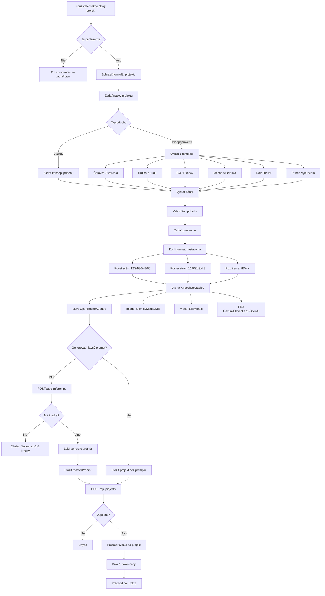

### 2. Vytvorenie postáv - Sequence Diagram

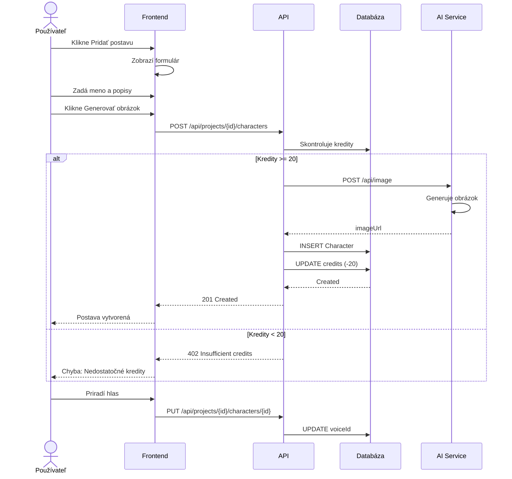

### 3. Generovanie scén

#### Tok vytvorenia scén

```mermaid
flowchart TD
    A[Start Krok 3] --> B{Scény existujú?}

    B -->|Nie| C{Vytvorenie scén}
    B -->|Áno| D[Úprava existujúcej]

    C --> C1{Automatické generovanie?}
    C1 -->|Áno| C2[POST /api/llm/scenes]
    C1 -->|Nie| C3[Manuálne vytvorenie]

    C2 --> C4[LLM rozdelí príbeh na N scén]
    C4 --> C5[Vytvorí T2I prompty]
    C5 --> C6[POST /api/projects/{id}/scenes]

    C3 --> C7[Zadať nadpis scény]
    C7 --> C8[Zadať popis scény]
    C8 --> C9[Zadať T2I prompt]
    C9 --> C6

    C6 --> E[Scéna vytvorená]
    D --> E

    E --> F[Úprava scény]
    D --> F

    F --> G[Upraviť T2I/I2V prompty]
    F --> H{Pridať dialógy?}

    H -->|Áno| I[Vybrať postavu]
    H -->|Nie| J[Nastaviť záber]

    I --> K[Zadať text dialógu]
    K --> L{Ďalší riadok?}
    L -->|Áno| I
    L -->|Nie| J

    J --> M{Typ záberu kamery}
    M -->|Detail| M1[close-up]
    M -->|Stredný| M2[medium]
    M -->|Široký| M3[wide]

    M1 --> N[PUT /api/projects/{id}/scenes/{id}]
    M2 --> N
    M3 --> N

    N --> O{Ďalšia scéna?}
    O -->|Áno| P[Úprava ďalšej scény]
    O -->|Nie| Q[Hotovo - Prejsť na generovanie obrázkov]
```

#### Tok generovania obrázkov

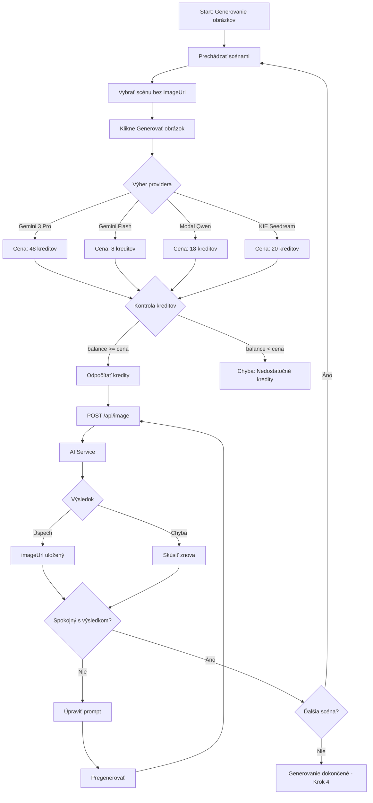

### 4. Generovanie obrázkov - Rozhodovací strom

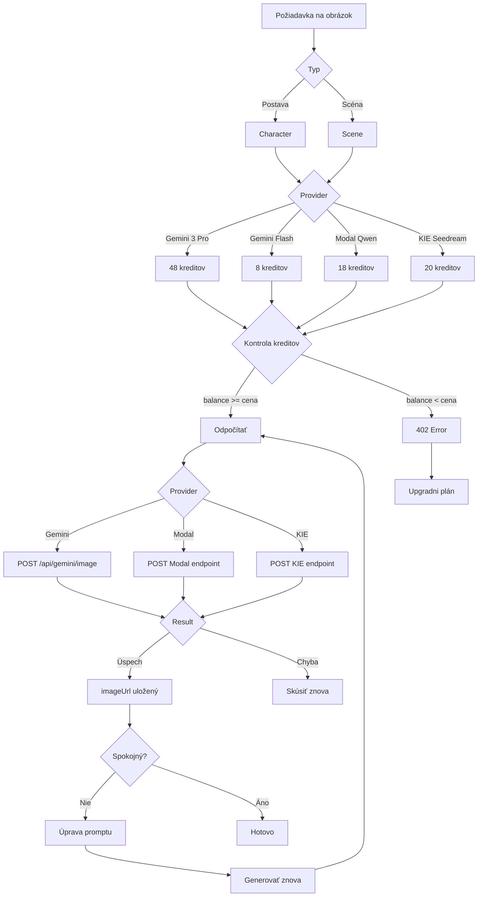

### 5. Generovanie videí

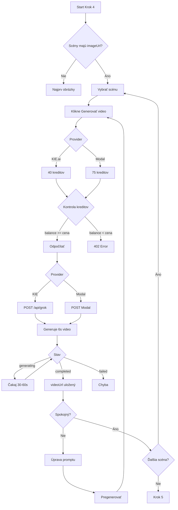

### 6. Generovanie hlasu

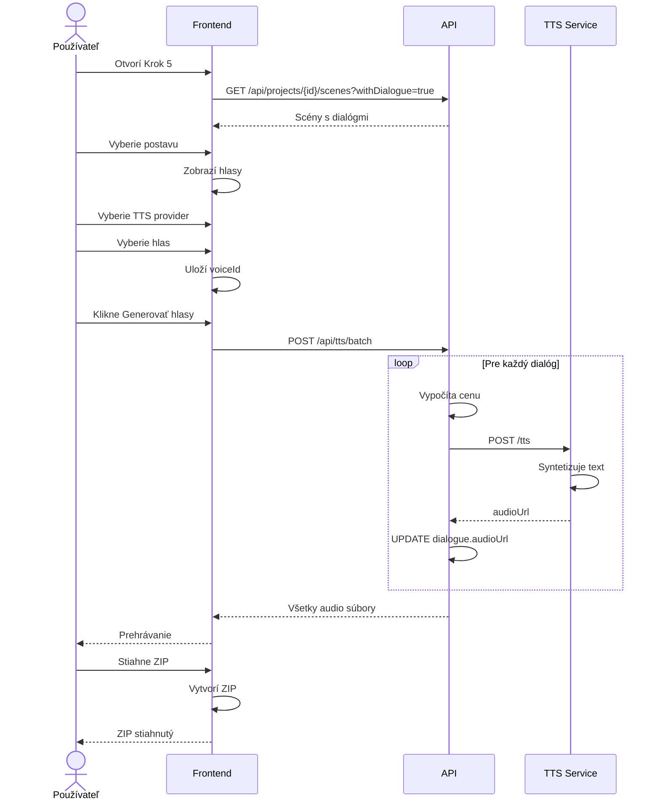

### 7. Export projektu

```mermaid
flowchart TD
    A[Start Krok 6] --> B[Zobraziť náhľad]
    B --> C{Všetko hotové?}

    C -->|Nie| D[Chýba prvok]
    D --> D1[imageUrl]
    D --> D2[videoUrl]
    D --> D3[audioUrl]

    D1 --> E[Návrat na krok]
    D2 --> E
    D3 --> E

    C -->|Áno| F[Nastaviť prechody]

    F --> G[Vybrať typ]
    G --> G1[Žiadny]
    G --> G2[Prelínanie]
    G --> G3[Posun]
    G --> G4[Zoom]

    G2 --> H[Trvanie 0.5-2s]
    G3 --> H
    G4 --> H

    H --> I{Hudba?}
    I -->|Áno| J[Generovať/Nahrať]
    I -->|Nie| K[Preskočiť]

    J --> L[Nastaviť hlasitosť]
    K --> L

    L --> M[Vybrať formát]
    M --> M1[JSON]
    M --> M2[Markdown]
    M --> M3[ZIP]

    M1 --> N[GET /api/projects/{id}/export]
    M2 --> N
    M3 --> O[POST /api/download-images]

    N --> P[Stiahnuť súbor]
    O --> P

    P --> Q{Renderovať video?}
    Q -->|Áno| R[POST /api/video/compose]
    R --> S[Zložiť MP4]
    S --> T[Stiahnuť video]

    Q -->|Nie| U[Koniec]
    T --> U
```

### 8. Systém rolí - Rozhodovací strom

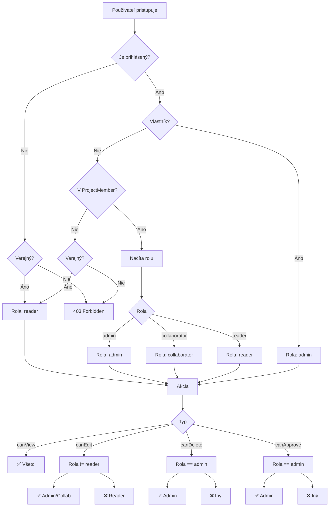

### 9. Regenerácia so schválením

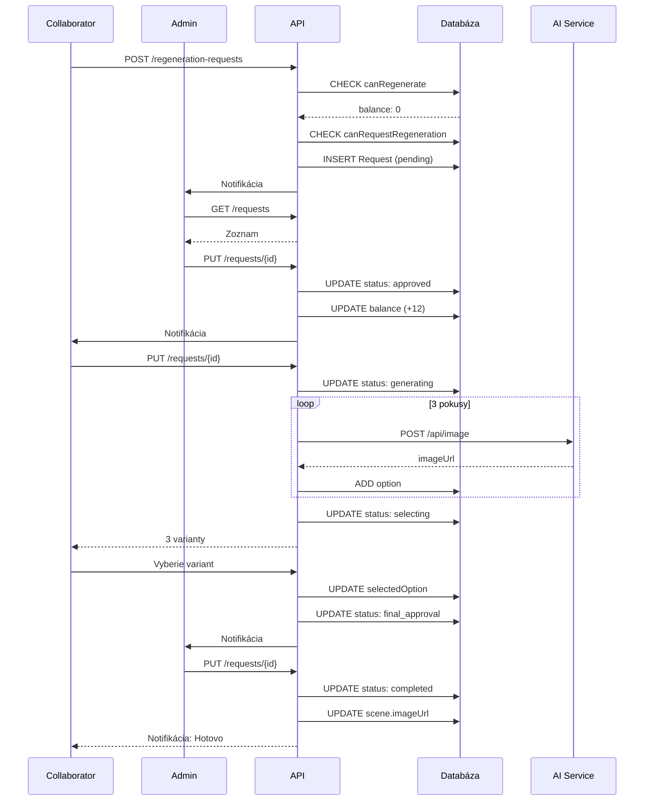

### 10. Manažment kreditov

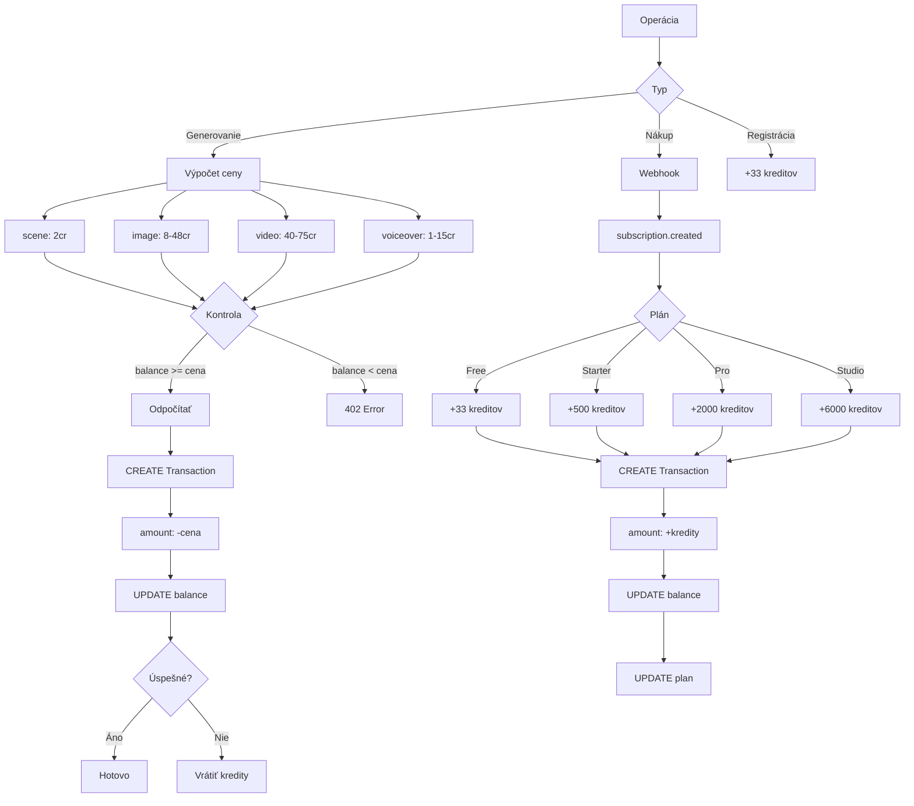

---

## Systém rolí a oprávnení

### ProjectRole

```typescript
type ProjectRole = 'admin' | 'collaborator' | 'reader';
```

### ProjectPermissions

```typescript
interface ProjectPermissions {
  canView: boolean;              // Zobraziť projekt
  canEdit: boolean;              // Upraviť prompty
  canRegenerate: boolean;        // Regenerovať (s kreditmi)
  canDelete: boolean;            // Priamo odstrániť (admin)
  canRequestDeletion: boolean;   // Žiadať o odstránenie (collab)
  canRequestRegeneration: boolean; // Žiadať o regeneráciu
  canManageMembers: boolean;     // Spravovať členov
  canApproveRequests: boolean;   // Schváliť žiadosti
}
```

### ROLE_PERMISSIONS

```typescript
const ROLE_PERMISSIONS: Record<ProjectRole, ProjectPermissions> = {
  admin: {
    canView: true,
    canEdit: true,
    canRegenerate: true,
    canDelete: true,
    canRequestDeletion: false,
    canRequestRegeneration: false,
    canManageMembers: true,
    canApproveRequests: true,
  },
  collaborator: {
    canView: true,
    canEdit: true,
    canRegenerate: true,
    canDelete: false,
    canRequestDeletion: true,
    canRequestRegeneration: true,
    canManageMembers: false,
    canApproveRequests: false,
  },
  reader: {
    canView: true,
    canEdit: false,
    canRegenerate: false,
    canDelete: false,
    canRequestDeletion: false,
    canRequestRegeneration: false,
    canManageMembers: false,
    canApproveRequests: false,
  },
};
```

### Porovnanie rolí

| Funkcia | Admin | Spolupracovník | Čitateľ |
|---------|-------|---------------|---------|
| Zobraziť projekt | ✅ | ✅ | ✅ |
| Upraviť prompty | ✅ | ✅ | ❌ |
| Regenerovať (s kreditmi) | ✅ | ✅ | ❌ |
| Priamo odstrániť | ✅ | ❌ | ❌ |
| Žiadať o odstránenie | ❌ | ✅ | ❌ |
| Regenerovať (žiadosť) | ❌ | ✅ | ❌ |
| Spravovať členov | ✅ | ❌ | ❌ |
| Schváliť žiadosti | ✅ | ❌ | ❌ |

---

## Autentizácia

### NextAuth konfigurácia

**Provider:** Google OAuth, Credentials

**Session Strategy:** JWT + Database

**Session Max Age:** 30 dní

#### Koncové body

- GET /api/auth/signin - Sign in page
- POST /api/auth/signin - Sign in (credentials)
- GET /api/auth/signout - Sign out
- POST /api/auth/register - Registrácia

#### Session

```typescript
interface Session {
  user: {
    id: string;
    name: string;
    email: string;
    image: string;
    isAdmin: boolean;
    plan: string;
  };
  expires: string;
}
```

### Tok dát v aplikácii

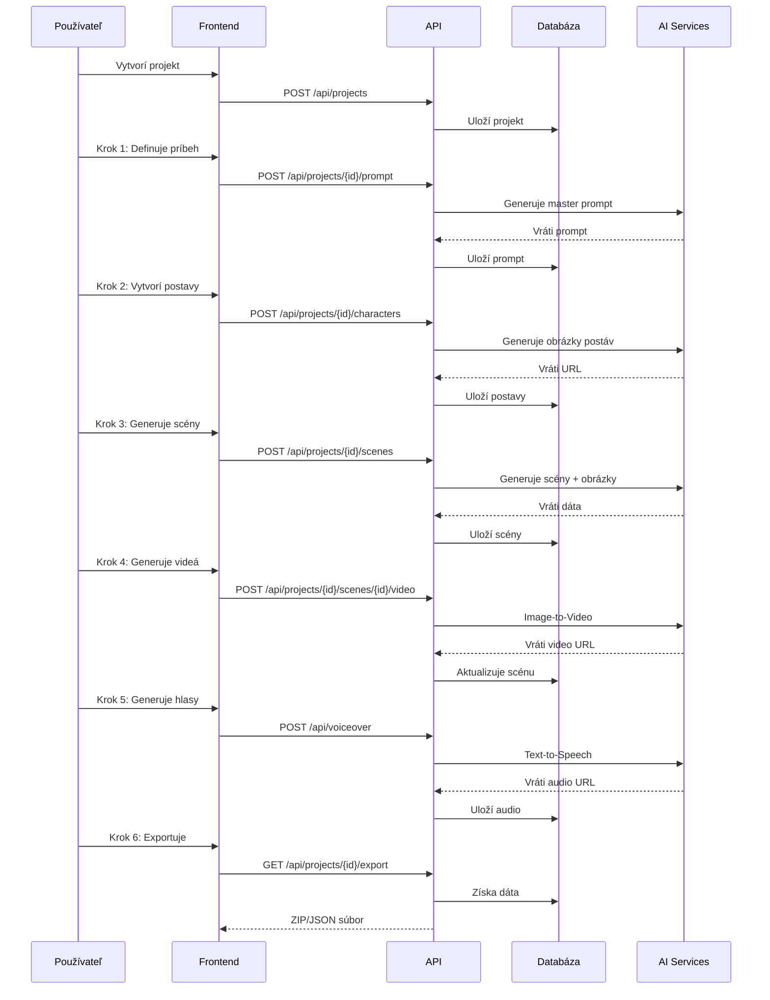

---

## Cache systém

### Cache kľúče

```typescript
const cacheKeys = {
  userProjects: (userId: string) => `user:${userId}:projects`,
  project: (projectId: string) => `project:${projectId}`,
  publicProjects: (page: number) => `public:projects:${page}`,
  projectCosts: (projectId: string) => `project:${projectId}:costs`,
};
```

### TTL (Time To Live)

- `userProjects`: 5 minút
- `project`: 5 minút
- `publicProjects`: 2 minút
- `costs`: 10 minút

### Invalácia

Cache sa invaliduje pri:
- Vytvorení/úprave/zmazaní projektu
- Zmenenej visibility
- Pridaní/odstránení člena
- Aktualizácii kreditov

---

## AI Poskytovatelia

### Cenovací model

```typescript
const DEFAULT_COSTS: Record<string, Record<string, number>> = {
  image: {
    gemini: 0.24,           // Gemini 3 Pro
    'gemini-flash': 0.039,  // Gemini Flash
    modal: 0.09,            // Modal Qwen
    'modal-edit': 0.09,     // Modal Qwen-Edit
  },
  video: {
    grok: 0.10,            // Grok video
    kie: 0.10,             // Kie.ai
    modal: 0.15,           // Modal Hallo3
  },
  voiceover: {
    elevenlabs: 0.03,      // ElevenLabs
    'gemini-tts': 0.002,   // Gemini TTS
    modal: 0.01,           // Modal Chatterbox
  },
  scene: {
    gemini: 0.001,         // Gemini scene gen
    claude: 0.01,          // Claude
    'claude-sdk': 0.01,    // Claude SDK
    grok: 0.003,           // Grok
    modal: 0.002,          // Modal LLM
    openrouter: 0.01,      // OpenRouter
  },
  music: {
    suno: 0.05,            // Suno
    piapi: 0.05,           // PiAPI
    modal: 0.03,           // Modal ACE-Step
  },
};
```

### Porovnanie poskytovateľov

| Typ | Poskytovateľ | Cena/operácia |
|-----|--------------|---------------|
| LLM | OpenRouter | 2 kreditov |
| LLM | Claude SDK | 2 kreditov |
| Image | Gemini 3 Pro | 48 kreditov |
| Image | Gemini Flash | 8 kreditov |
| Image | Modal Qwen | 18 kreditov |
| Video | KIE.ai Grok | 40 kreditov |
| Video | Modal Hallo3 | 75 kreditov |
| TTS | Gemini TTS | 1 kredit |
| TTS | ElevenLabs | 6 kreditov |
| Music | PiAPI | 10 kreditov |

---

## Cenové plány


### Porovnanie plánov

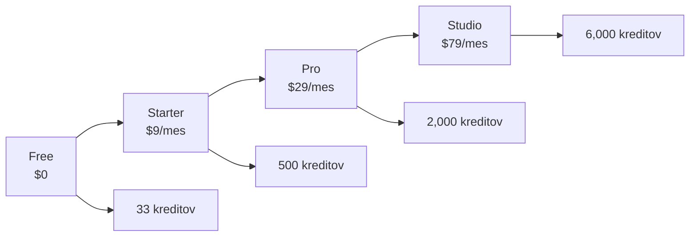

| Funkcia | Free | Starter | Pro | Studio |
|---------|------|---------|-----|--------|
| Cena | $0 | $9/mes | $29/mes | $79/mes |
| Kredity/mesiac | 33 | 500 | 2,000 | 6,000 |
| Projekty | 1 | 3 | 10 | Neobmedzene |
| Postavy | 4 | 8 | 16 | Neobmedzene |
| Scény | 12 | 24 | 60 | Neobmedzene |
| AI modely | Základné | Všetky | Všetky | Všetky |
| Priorita | Normálna | Vysoká | Najvyššia | Exkluzívna |
| Podpora | Komunita | E-mail | Prioritná | Vyhradená |

---

## Chybové kódy

| Status | Kód | Popis |
|--------|-----|-------|
| 200 | OK | Úspešný request |
| 201 | Created | Záznam vytvorený |
| 400 | Bad Request | Neplatný request |
| 401 | Unauthorized | Nie je prihlásený |
| 403 | Forbidden | Nedostatočné oprávnenie |
| 404 | Not Found | Záznam nenájdený |
| 500 | Internal Server Error | Chyba serveru |

### 403 Error varianty

```json
// Direct delete denied
{
  "error": "Deletion requires admin approval",
  "requiresApproval": true,
  "canRequestDeletion": true
}

// Insufficient permissions
{
  "error": "Insufficient permissions. Required: canEdit"
}

// Insufficient credits
{
  "error": "Insufficient credits. Required: 20, Available: 15"
}
```

---

## Príručka spolupráce

### Stavy scén

#### 🟢 Schválené - Pripravené na regeneráciu

Admin schválil žiadosť. Kliknite na animovaný odznak pre otvorenie panela regenerácie. Máte 3 pokusy.

#### 🔄 Generuje sa

Obrázok alebo video sa generuje. Môže to trvať 30-60 sekúnd.

#### ⚡ Výber - Vyberte najlepšiu možnosť

Všetky pokusy sú dokončené. Kliknite na odznak pre zobrazenie všetkých možností.

#### ⏳ Čaká na finálne schválenie

Vybrali ste najlepšiu možnosť. Čakáte na schválenie od admina.

#### 📝 Čakajúca žiadosť o regeneráciu

Požiadali ste o regeneráciu. Čakáte na schválenie od admina.

#### 🗑️ Čakajúca žiadosť o odstránenie

Požiadali ste o odstránenie. Čakáte na schválenie od admina.

### Priebeh regenerácie

1. **Žiadosť** - Spolupracovník pošle žiadosť
2. **Schválené** - Admin schváli (kredity sa preplácajú)
3. **Generuje sa** - Generujú sa 3 varianty
4. **Výber** - Spolupracovník vyberie najlepší
5. **Čaká** - Čaká na finálne schválenie
6. **✓ Hotovo** - Aplikované na scénu

---

© 2026 Generátor filmov. Kompletná Technická Dokumentácia.
